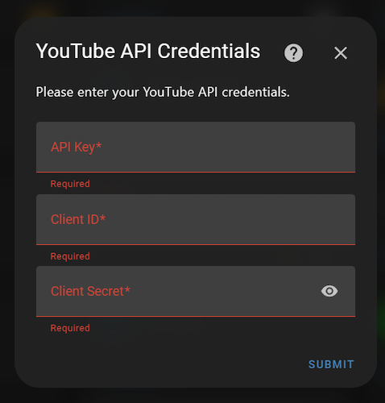
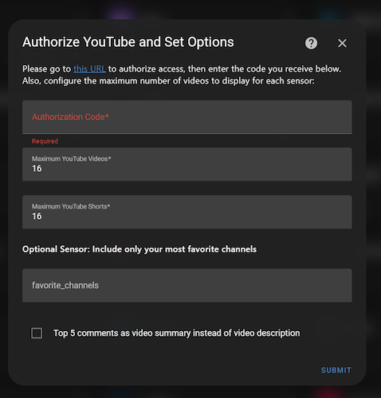

# Setting Up YouTube Recently Added Integration

You'll need a Google Account to get started. The entire process takes about 5-10 minutes.

## 1. Create Project
1. Go to [Google Cloud Console](https://console.cloud.google.com)
2. Click the dropdown at top → "New Project"
3. Name it "YouTube Recently Added" → Create

## 2. Enable YouTube API
1. Click "APIs & Services" → "Library"
2. Search for "YouTube Data API v3"
3. Click Enable

## 3. Set Up OAuth Screen
1. Go to "OAuth consent screen"
2. Choose "External" → Create
3. Enter app name "YouTube Recently Added"
4. Add your gmail email address to "Test Users"
5. Save and Continue (skip remaining screens)

## 4. Get Client ID
1. Go to "Credentials"
2. Create Credentials → "OAuth client ID"
3. Choose "Desktop application"
4. Name it "YouTube Recently Added"
5. Create and save your Client ID & Secret

## 5. Get API Key
1. Create Credentials → "API Key"
2. Copy the key
3. Edit the key:
   - Set "HTTP referrers" restriction
   - Restrict to YouTube Data API v3

That's it! You now have all required credentials for the integration!

## 6. Add Integration
1. Type YouTube Recently Added
2. Enter credentials you created in previous steps and click SUBMIT

   
3. In the below screen, click on the `this URL` hyperlink.

   

4. Clicking on the hyperlink will take you to a webpage that looks like below:
